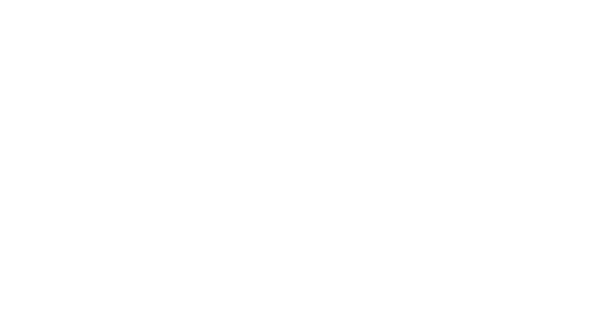

<p align="center">
  
</p>

[](https://github.com/khbarkar/BoneStack/actions/workflows/go.yml)

# BoneStack

Container diagnostics, forensics, and optimization in a TUI.

## Install

```bash
curl -fsSL https://raw.githubusercontent.com/khbarkar/BoneStack/main/install.sh | bash
```

Requirements:

- Go
- Git
- Docker

The installer:

- clones or updates BoneStack in `~/.bonestack`
- builds the binary locally
- links `bonestack` into `~/.local/bin`

If `~/.local/bin` is not on your `PATH`, add:

```bash
export PATH="$HOME/.local/bin:$PATH"
```

## Update

Use the built-in update command:

```bash
bonestack update
```

If you have not installed BoneStack yet, use:

```bash
curl -fsSL https://raw.githubusercontent.com/khbarkar/BoneStack/main/install.sh | bash
```

## Run

```bash
bonestack
```

Useful commands:

```bash
bonestack help
bonestack version
bonestack update
```

## What It Does

- inspect images and containers
- analyze image layers and bloat
- generate optimization reports
- generate starter Dockerfiles and policy files
- run container forensics:
  - filesystem
  - processes
  - volumes
  - logs
  - environment
  - resources
  - threat hunt
  - container diff
  - timeline
- export reports in `json`, `csv`, and `html`
- optionally use YARA during threat hunting

## Docs

- [Docs Index](docs/README.md)
- [Forensics Guide](docs/forensics.md)
- [YARA Guide](docs/yara.md)
- [Training Guide](docs/training.md)

## Training Containers

Safe training examples live in [training/containers](training/containers/README.md).

They are intentionally suspicious-looking or poorly built, but not malicious.

Examples include:

- cron persistence style artifacts
- suspicious SSH and shell-history artifacts
- a badly built, bloated Node image

## Build From Source

```bash
go build -o bonestack ./cmd/bonestack/main.go
./bonestack
```
